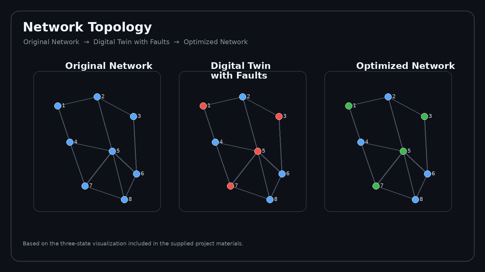
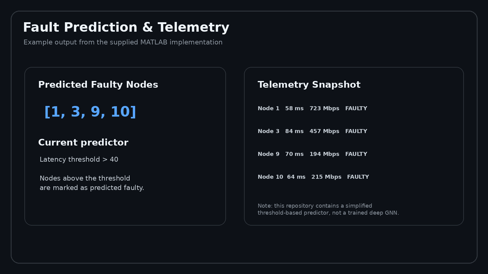
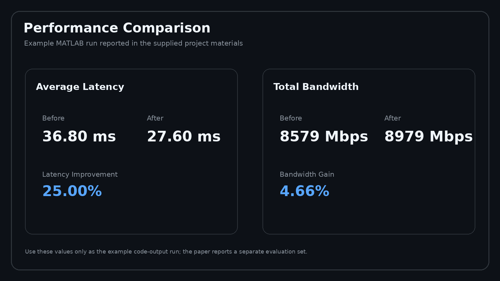
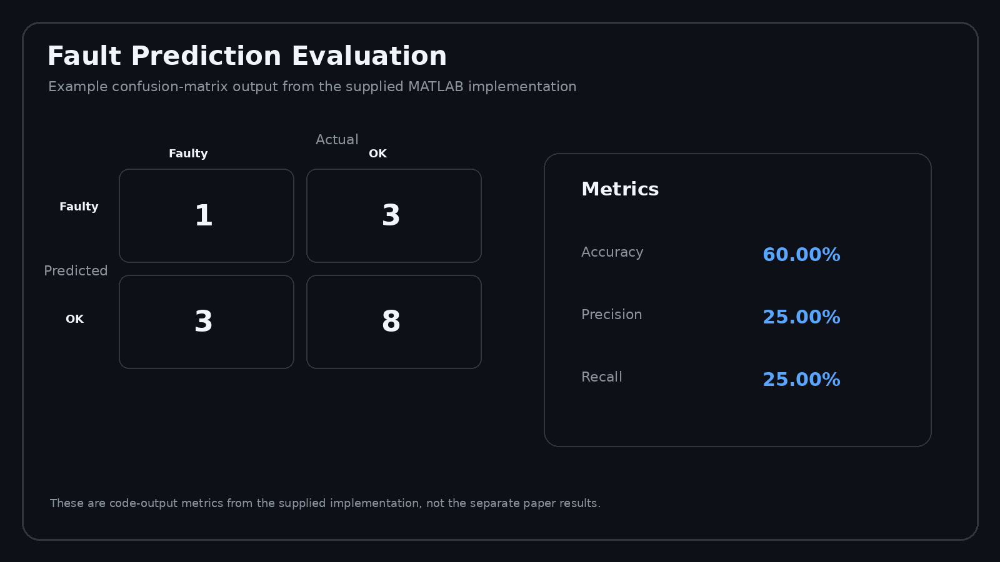

# MATLAB Digital Twin Framework for 5G/6G Fault Prediction & Network Optimization

A MATLAB-based simulation framework for modeling 5G/6G communication networks, injecting simulated faults, analyzing network telemetry, identifying fault-prone nodes, and evaluating network optimization strategies.

## 📌 Project Overview

Next-generation 5G/6G networks contain complex and dynamic topologies where changing traffic conditions, congestion, latency, and node failures can affect network reliability.

This project develops a MATLAB-based **Digital Twin simulation framework** that creates a virtual representation of a communication network and evaluates fault prediction and network optimization workflows.

The project models network nodes and links using graph structures and tracks parameters such as:

* Node latency
* Bandwidth
* Node status
* Network connectivity
* Simulated fault conditions

The Digital Twin provides a controlled environment for fault simulation, analysis, visualization, and performance comparison.

## 🎯 Objectives

* Simulate a 5G/6G network topology using MATLAB graph structures
* Generate network telemetry such as latency and bandwidth
* Create a Digital Twin representation of the network
* Inject simulated node faults
* Extract graph-structured network data
* Identify fault-prone nodes
* Apply simulated network optimization
* Compare performance before and after optimization
* Generate fault prediction and performance metrics
* Visualize network states and analytical results

## 🏗️ Workflow

```text
Network Modeling
       ↓
Digital Twin Simulation
       ↓
Telemetry Generation
       ↓
Graph Data Extraction
       ↓
Fault Prediction
       ↓
Network Optimization
       ↓
Performance Evaluation
       ↓
Visualization & Report
```

## 🧠 Methodology

### 1. Network Modeling

A synthetic network topology is generated using MATLAB graph functions. The current implementation creates a network containing **15 simulated nodes**, with randomly generated connectivity, latency, and bandwidth values.

### 2. Digital Twin Simulation

The Digital Twin acts as a simulated virtual representation of the network.

Fault conditions are injected into the simulation and node telemetry is updated to represent degraded network behavior.

### 3. Graph Data Extraction

The network is converted into graph-structured data using:

* Adjacency matrix
* Node feature matrix
* Latency
* Bandwidth

This representation prepares the network state for fault-analysis workflows.

### 4. Fault Prediction

The current MATLAB implementation uses a **threshold-based fault prediction mechanism** as a simplified GNN-like simulation.

Nodes with latency above the configured threshold are classified as predicted faulty nodes.

> Note: This repository currently contains the MATLAB simulation implementation. A full trained deep GNN/Python implementation is not included in the current codebase.

### 5. Network Optimization

Predicted faulty nodes are processed by the optimization module.

The current simulation:

* Reduces latency
* Increases bandwidth
* Changes the node status to `HEALED`

The resulting network is then compared with the pre-optimization state.

### 6. Evaluation

The framework calculates:

* Accuracy
* Precision
* Recall
* Confusion Matrix
* Average latency before/after optimization
* Total bandwidth before/after optimization

## 🧰 Technologies

* MATLAB
* MATLAB Graph Functions
* Graph Theory
* Digital Twin Simulation
* Network Simulation
* Fault Prediction
* Data Analysis
* Data Visualization
* Machine Learning Concepts

## 📂 Repository Structure

```text
.
├── matlab/
│   ├── main.m
│   ├── generate_network.m
│   ├── update_digital_twin.m
│   ├── extract_graph_data.m
│   ├── gnn_fault_predictor.m
│   ├── optimize_network.m
│   ├── visualize_network.m
│   ├── plot_performance.m
│   └── generate_network_report.m
│
├── results/
│   ├── network_topology.png
│   ├── fault_prediction.png
│   ├── performance_comparison.png
│   └── confusion_matrix.png
│
└── docs/
    └── GNN-Paper.pdf
```

## 📊 Results

The MATLAB simulation evaluates the network before and after optimization.

### Network Topology

**Original Network → Digital Twin with Faults → Optimized Network**



### Fault Prediction & Telemetry

The current MATLAB implementation uses a simplified latency-threshold method to identify predicted faulty nodes.



### Performance Comparison

Example output from the supplied MATLAB implementation:



### Fault Prediction Evaluation

Example confusion-matrix output from the supplied MATLAB implementation:



## ▶️ How to Run

### Requirements

* MATLAB
* MATLAB Graph Functions / Graph support

### Steps

1. Open MATLAB.
2. Download or clone this repository.
3. Open the `matlab` folder.
4. Set the `matlab` folder as the working directory.
5. Run the main script:

```matlab
main
```

### Workflow

```text
Network Generation
        ↓
Digital Twin Simulation
        ↓
Graph Data Extraction
        ↓
Fault Prediction
        ↓
Network Optimization
        ↓
Visualization
        ↓
Report Generation
```


## 📈 Example Performance Output

Example results from the supplied project materials include:

| Metric              | Before Optimization | After Optimization |
| ------------------- | ------------------: | -----------------: |
| Average Latency     |            36.80 ms |           27.60 ms |
| Total Bandwidth     |           8579 Mbps |          8979 Mbps |
| Latency Improvement |                   — |             25.00% |
| Bandwidth Gain      |                   — |              4.66% |

The supplied project output also reports:

| Prediction Metric | Result |
| ----------------- | -----: |
| Accuracy          | 60.00% |
| Precision         | 25.00% |
| Recall            | 25.00% |

These values come from the example MATLAB simulation output in the project materials.

## 📚 Research Paper

The project was presented as:

**A Digital Twin and Graph Neural Network-Based Framework for Fault Prediction and Optimization in 5G/6G Networks**

The repository includes the project paper in the `docs/` directory.

## 👨‍💻 Author

**Prasath B**

Electronics and Communication Engineering
Vel Tech High Tech Dr. Rangarajan Dr. Sakunthala Engineering College

### Connect

* LinkedIn:https://www.linkedin.com/in/prasath-b-a10546334/
* GitHub: https://github.com/Prasath-B8506
* Email: [prasathb8506@gmail.com](mailto:prasathb8506@gmail.com)

## ⭐ Key Learning Outcomes

This project provided practical experience in:

* Network data simulation
* Graph-based data representation
* Data analysis
* Performance evaluation
* MATLAB programming
* Fault-analysis workflows
* Data visualization
* Technical reporting
